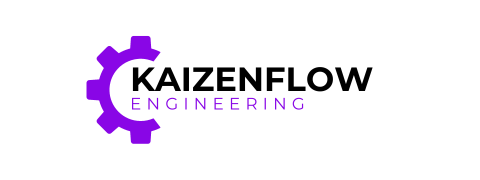
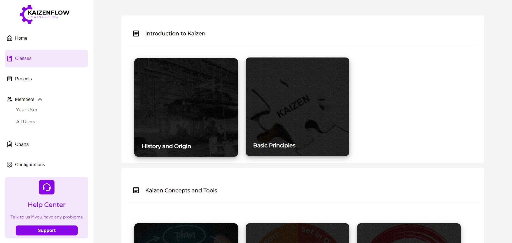
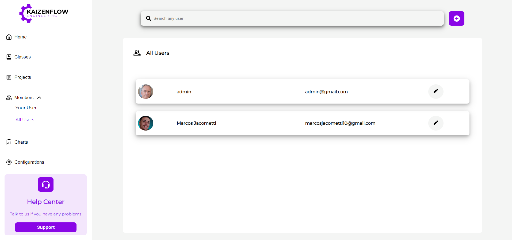
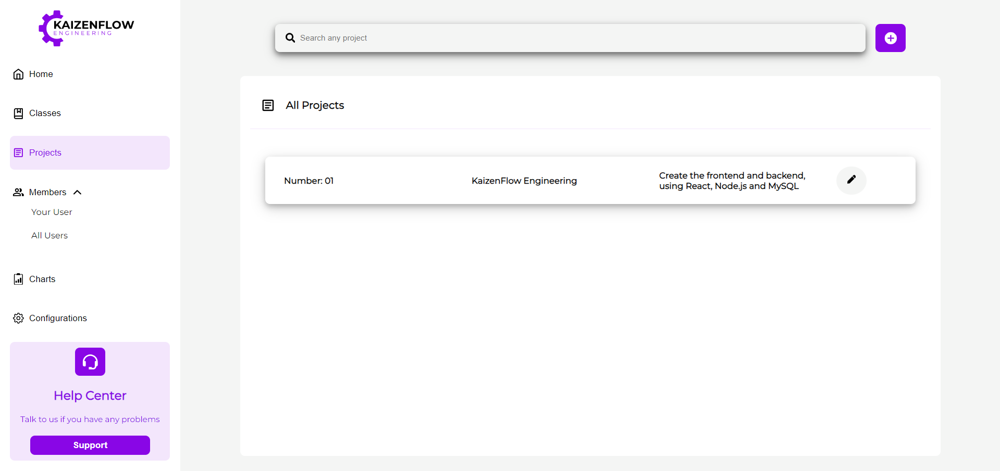
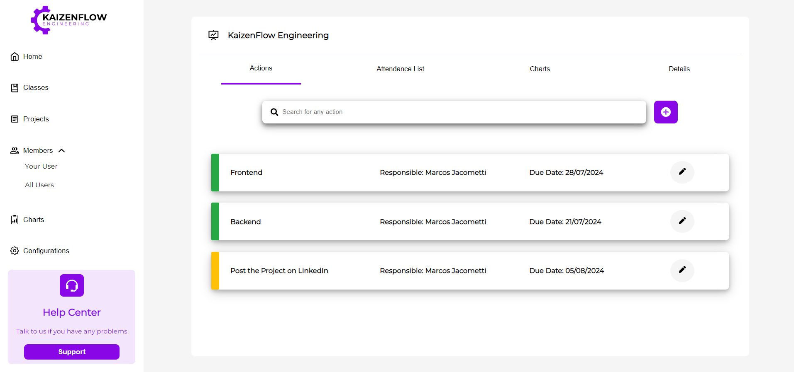
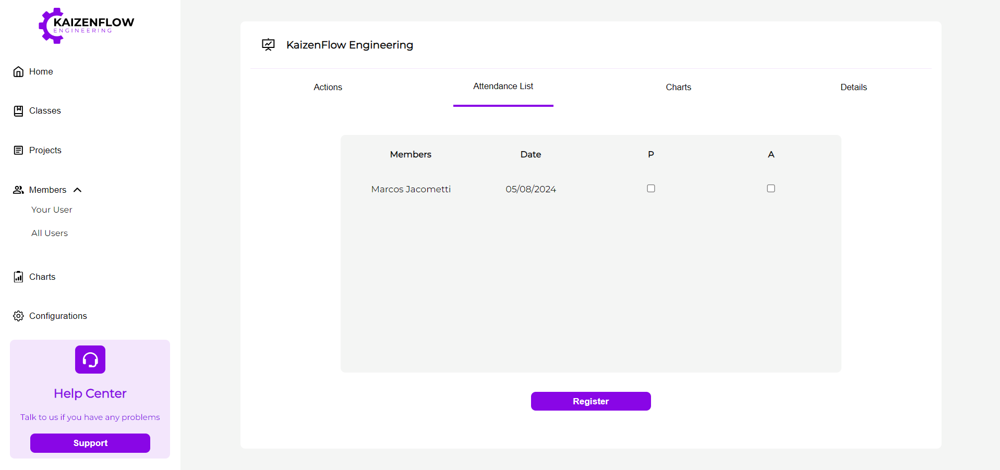
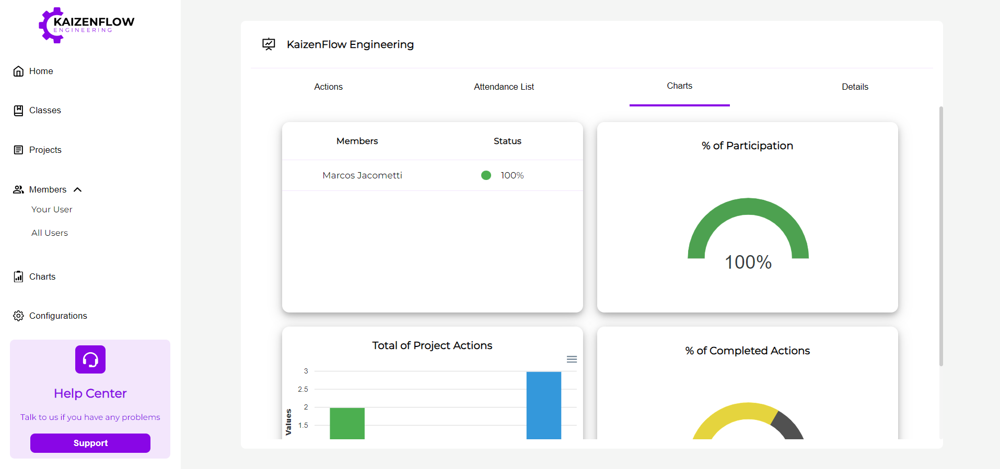

    

    
    
    

## Welcome to the KaizenFlow Engineering ⚙️

Create and manage projects, members, actions, meetings and classes of your continuous improvement system. With the KaizenFlow Engineering you can have the best Kaizen program in your company or life. 

You'll have classes: 

    

You can manage the members and create users for them:

    

Create projects:

    

For the projects, you can have actions and manage that:

    

For the meetings, get the attendance list:

    

And, you can see all the informations in charts for each project:

    

## Frontend technologies and libs

- [React.JS](https://pt-br.legacy.reactjs.org/)
- [Express](https://expressjs.com/pt-br/)
- [Axios](https://axios-http.com/ptbr/docs/intro)
- [Styled-Components](https://styled-components.com/)
- [React-router-dom](https://reactrouter.com/en/main)
- [React-toastify](https://www.npmjs.com/package/react-toastify)
- [React-icons](https://react-icons.github.io/react-icons/)
- [React Responsive](https://www.npmjs.com/package/react-responsive)
- [Apex Charts](https://apexcharts.com/docs/installation/)
- [Dotenv](https://www.dotenv.org/docs/)
- [React Select](https://react-select.com/home)
- [Jwt-Decode](https://jwt.io/)

## Backend technologies and libs

- [Node.js](https://nodejs.org/en)
- [MySQL](https://www.mysql.com/)
- [Express](https://expressjs.com/pt-br/)
- [Axios](https://axios-http.com/ptbr/docs/intro)
- [Cors](https://developer.mozilla.org/pt-BR/docs/Web/HTTP/CORS)
- [Bcrypt](https://www.npmjs.com/package/bcrypt)
- [Dotenv](https://www.dotenv.org/docs/)
- [Multer](https://www.npmjs.com/package/multer)
- [JsonWebToken](https://www.npmjs.com/package/jsonwebtoken)

## Contact me if you want

- Email: [Marcos Jacometti](marcosjacometti10@gmail.com)
- LinkedIn: [Marcos Jacometti](https://www.linkedin.com/in/marcos-vin%C3%ADcius-jacometti-675202202/)

I appreciate your time, I hope you enjoy the KaizenFlow! ✅

See you in the next repository...